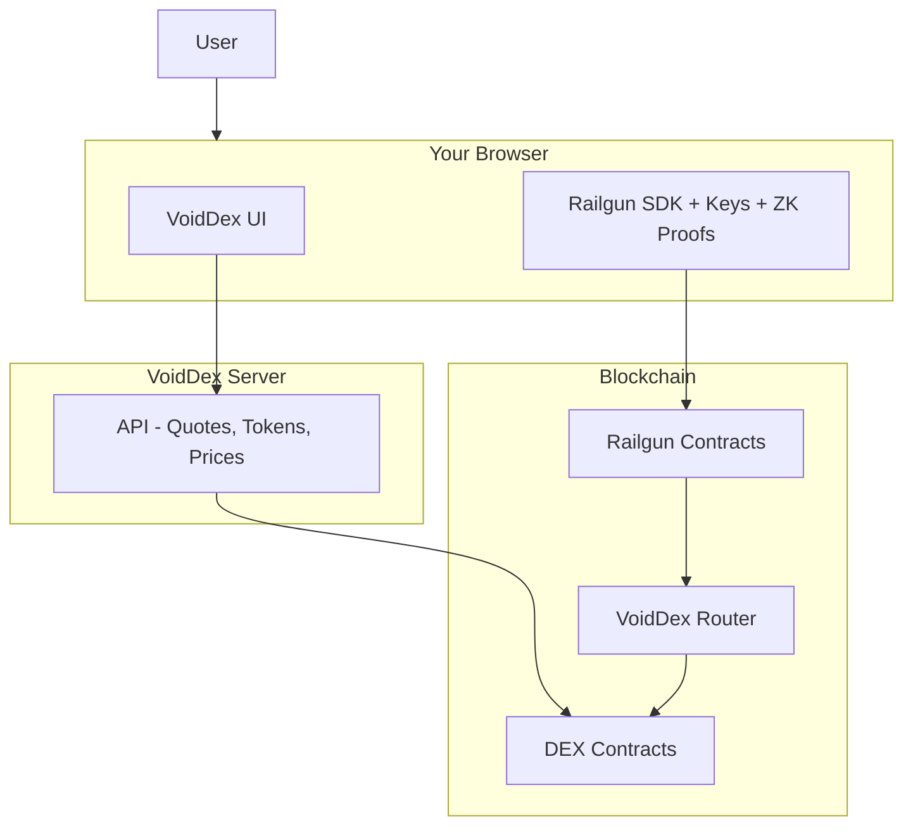

import { DocImage } from '@/components/DocImage';

<DocImage title="Architecture" />

VoidDex consists of a frontend application, backend API, and integration with the Railgun SDK. The key architectural decision is that all privacy-critical operations run entirely in your browser, while the server only handles public data.

## System Overview

Your private keys and ZK proofs never leave your browser. The server has no access to your private data. Even if the server is compromised, your funds remain safe because all sensitive operations happen locally.

## Client vs Server

| Component | Location | Data Handled |
|-----------|----------|--------------|
| Private Keys | Browser | Never transmitted |
| ZK Proofs | Browser | Generated locally |
| Balance Decryption | Browser | Only you can see |
| Swap Quotes | Server | Public price data |
| Token Lists | Server | Public token info |
| Authentication | Server | Wallet signatures only |

## Frontend

The frontend is built with Next.js 15 and React. It provides the swap interface where users select tokens, enter amounts, and view quotes. Wallet connection is handled through RainbowKit, which supports MetaMask, WalletConnect, and other popular wallets.

The private wallet functionality is powered by the Railgun SDK, which runs entirely in the browser. This includes wallet creation, balance management, and transaction signing. State management uses React hooks and context providers to keep the UI responsive.

## Backend API

The backend is built with NestJS and handles non-sensitive operations. The Quote Service aggregates prices from multiple DEXes including Uniswap V3/V2, SushiSwap, PancakeSwap, QuickSwap, Camelot, and more. It queries these contracts on-chain using factory and quoter contracts to find the optimal route for each swap.

The Price Service fetches token prices from CoinGecko. The Token Service manages token lists with verified pool availability for each supported network.

## Railgun Integration

The frontend integrates directly with the Railgun SDK for all privacy features. Wallet management includes creating encrypted wallets with mnemonic backup, unlocking with password, and deriving chain-specific addresses.

Privacy operations include shielding tokens into your private balance, unshielding to withdraw to any public address, transferring privately to other Railgun addresses, and executing private swaps through the VoidDex Router contract.

The SDK also handles balance scanning, which involves syncing with the blockchain to find incoming transactions, decrypting your private balances, and maintaining merkle tree state.

## Security

- Your private keys are generated in your browser and never transmitted
- All Railgun operations including proof generation happen locally
- Wallet data is encrypted with your password before storage
