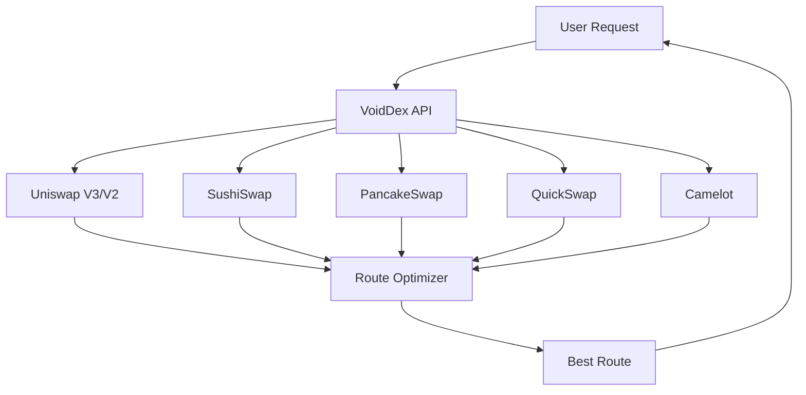

import { DocImage } from '@/components/DocImage';

<DocImage title="DEX Aggregation" />

VoidDex aggregates liquidity across multiple decentralized exchanges to find you the best swap rates. This page explains how routing works.

## How It Works

VoidDex queries multiple DEX contracts directly on-chain to find the best rates. When you request a swap, the VoidDex API queries all supported DEXes simultaneously. The route optimizer then analyzes all quotes to find the best single route or split route across multiple DEXes. The optimal route is returned to you with full price and route information.

## Liquidity Sources

| Chain | DEXes |
|-------|-------|
| Ethereum | Uniswap V3, Uniswap V2, SushiSwap, SushiSwap V3 |
| Polygon | Uniswap V3, QuickSwap, QuickSwap V3, SushiSwap, ApeSwap |
| Arbitrum | Uniswap V3, SushiSwap, SushiSwap V3, Camelot, Trader Joe |
| BSC | PancakeSwap V3, PancakeSwap V2, SushiSwap, Biswap, ApeSwap |
| Sepolia | Uniswap V3 (Testnet) |

Each mainnet chain has 4-5 DEXes integrated to ensure competitive rates across all trading pairs.

## Smart Routing

The VoidDex route optimizer compares quotes from every supported DEX on the current chain. When beneficial, it can split your order across up to three different DEXes to get a better overall rate. The optimizer factors in gas costs when selecting routes, ensuring that split routes are only used when the improved rate outweighs the additional gas. The final route is always selected to maximize the tokens you receive.

## Quote Display

When you enter a swap amount, VoidDex displays the expected output amount, the price per token, and the minimum you'll receive after accounting for slippage. You can also see the route information showing which DEXes will be used and how your order will be split if applicable.

## Slippage Settings

| Setting | Use Case |
|---------|----------|
| 0.5% | Stable pairs with deep liquidity |
| 1% | Default for most trades |
| Custom | Volatile pairs or large trades |

If the price moves more than your slippage tolerance between when you submit the transaction and when it executes, the transaction will automatically revert to protect you from unfavorable fills.

## Private Execution

While quotes are fetched on-chain via the VoidDex API, the actual swap execution happens through Railgun's privacy layer. The quote discovery happens server-side so you get fast quotes without revealing your intent. But the swap execution is private using zkSNARK proofs, ensuring your trading activity remains hidden from on-chain observers.
