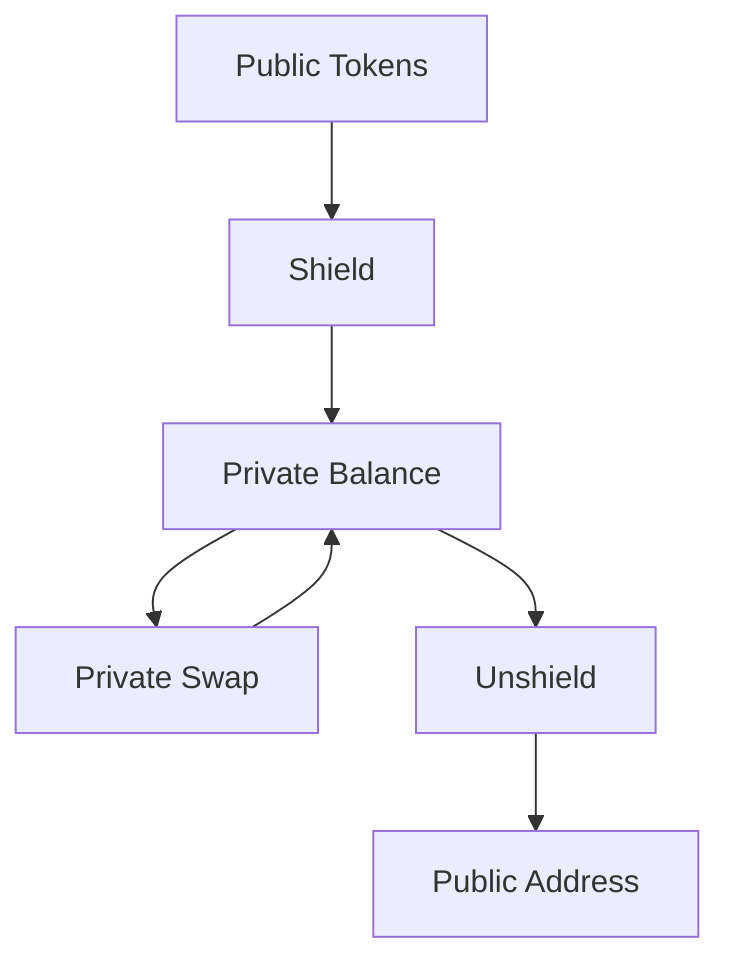
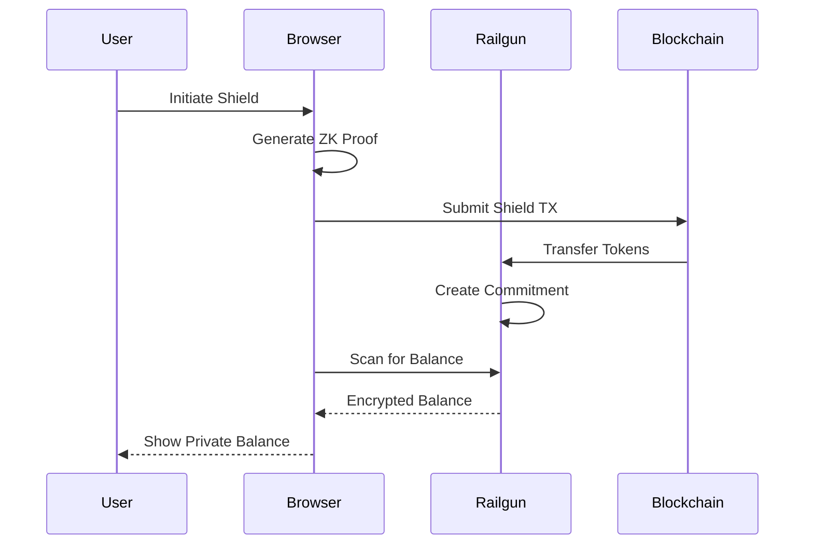
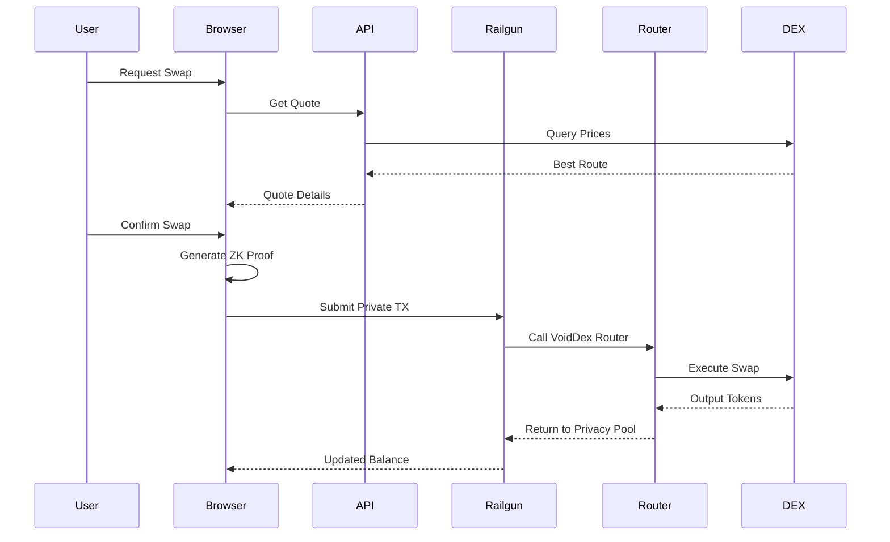
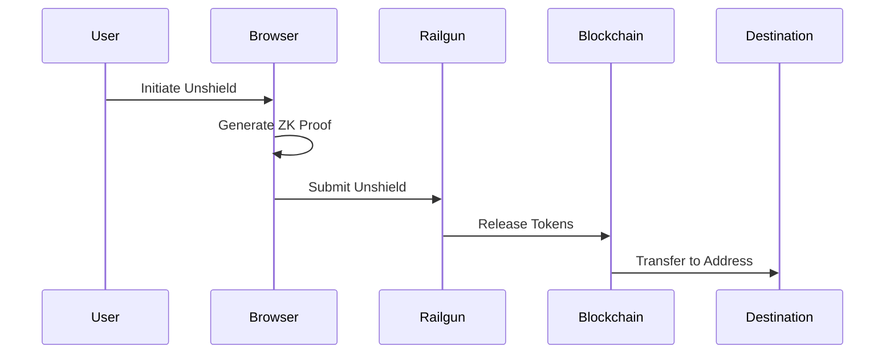

import { DocImage } from '@/components/DocImage';

<DocImage title="How It Works" />

VoidDex combines DEX aggregation with Railgun's privacy layer to enable private token swaps. This page explains the technical flow and what happens when you execute privacy operations.

## The Privacy Flow

Your tokens start in your public wallet visible on the blockchain. When you shield them, they enter Railgun's privacy pool and become part of your private balance. You can then execute swaps privately, with the output going back to your private balance. When you're ready to use tokens publicly, you unshield them to any address.

## What's Hidden

| Operation | What's Hidden | What's Visible |
|-----------|---------------|----------------|
| Shield | Final destination | Source address, amount |
| Private Swap | Everything | Nothing (just a Railgun TX) |
| Unshield | Source of funds | Destination address, amount |
| Transfer | Sender & recipient | Nothing (just a Railgun TX) |

## Shield Flow

When you shield tokens, they are transferred to the Railgun smart contract and a zkSNARK commitment is created that represents your balance. This commitment hides your wallet address, the token amount, and the token type. Your shielded balance is only visible to you through your private wallet because only you have the keys to decrypt it.

## Private Swap Flow

When you execute a swap, VoidDex fetches the best quote from multiple DEXes. The Railgun SDK then generates a zero-knowledge proof in your browser. This proof demonstrates you have sufficient balance without revealing which specific tokens are yours. The swap executes through Railgun which calls the VoidDex Router contract to perform the actual DEX swap. Output tokens are automatically shielded back into your private balance.

## Unshield Flow

When you unshield, you generate a proof that you own certain tokens in the privacy pool. The Railgun contract verifies this proof and releases the tokens to your specified destination address. The destination can be any Ethereum address including your own public wallet or a completely different address.

## Why Railgun?

Railgun is the leading privacy protocol for DeFi. It uses zkSNARK proofs which provide cryptographically proven privacy that cannot be broken without solving extremely hard mathematical problems. The protocol has processed significant volume securely and works with any ERC-20 token. It's fully non-custodial with no trusted parties holding your funds.

## Technical Details

VoidDex uses the Railgun SDK which runs entirely in your browser. It handles wallet creation and encryption, balance scanning and merkle tree synchronization, zero-knowledge proof generation, and transaction construction. All cryptographic operations use WASM modules for performance. See [Architecture](/docs/architecture) for more technical details.
