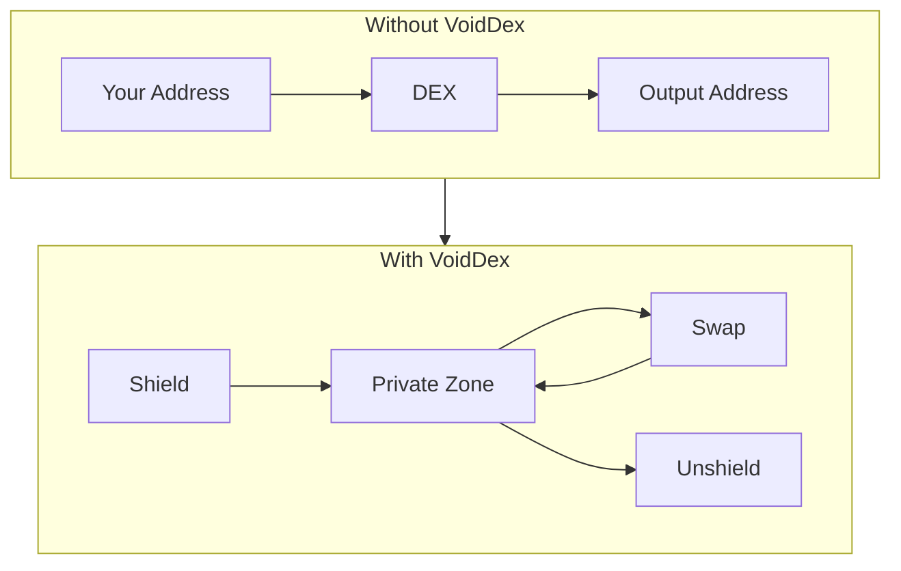

import { DocImage } from '@/components/DocImage';

<DocImage title="Private Swaps" />

Private swaps are the core feature of VoidDex. This page explains what makes a swap "private" and how VoidDex protects your trading activity.

## What is a Private Swap?

A private swap executes a token exchange while hiding the sender address, recipient address, amounts traded, and token types involved. All this information is encrypted using zero-knowledge proofs, making it impossible for blockchain observers to link your activity to your identity.

## Privacy Comparison

Without VoidDex, your entire swap transaction is visible on-chain. Anyone can see which address initiated the swap, what tokens were exchanged, and where the output went. With VoidDex, only the shield and unshield transactions are visible. Everything that happens in the private zone including swaps is completely hidden from blockchain observers.

## What's Hidden

| Data | Without VoidDex | With VoidDex |
|------|-----------------|--------------|
| Sender Address | Visible | Hidden |
| Recipient Address | Visible | Hidden |
| Token Types | Visible | Hidden |
| Amounts | Visible | Hidden |
| Swap History | Fully traceable | Unlinkable |

## How Private Swaps Work

Your tokens must already be in your private Railgun balance before swapping. When you initiate a swap, a zero-knowledge proof is generated locally on your device. This proof mathematically demonstrates that you have sufficient balance without revealing which specific tokens are yours. The swap then executes through Railgun's privacy system and output tokens arrive in your private balance.

The entire swap happens within Railgun's privacy layer. On-chain observers see a Railgun transaction but cannot determine what tokens were swapped or the amounts involved.

## Requirements

| Requirement | Description |
|-------------|-------------|
| Connected Wallet | For signing transactions |
| Private Wallet | Unlocked Railgun wallet |
| Shielded Balance | Tokens in your private balance |
| WETH Balance | For broadcaster fees (private swaps) |

## Best Practices

- Keep tokens shielded between swaps rather than immediately unshielding
- Use different destination addresses when unshielding
- Avoid round numbers that could be correlated with shield amounts
- Maintain a WETH balance for broadcaster fees when executing private swaps

<Callout type="warn">
While VoidDex provides strong privacy through Railgun, no system is 100% anonymous. Always consider your threat model.
</Callout>
