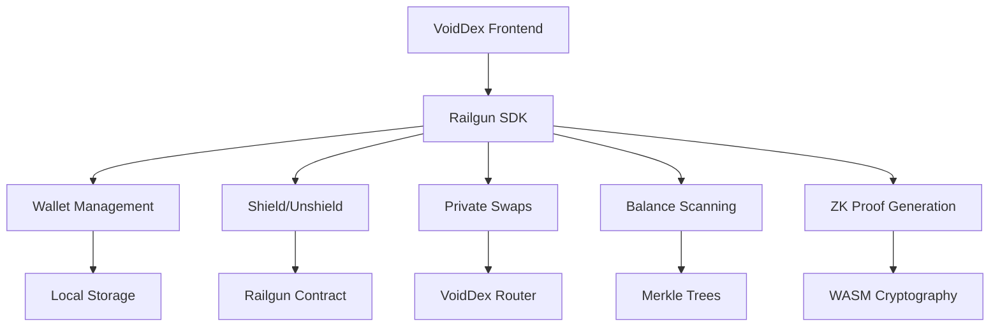

import { DocImage } from '@/components/DocImage';

<DocImage title="Railgun Integration" />

VoidDex is powered by Railgun, the leading privacy protocol for DeFi. This page explains how we integrate with Railgun and what privacy guarantees you receive.

## What is Railgun?

Railgun is a smart contract system that enables private transactions on public blockchains. It uses zkSNARK cryptography to prove transaction validity without revealing details. The protocol provides mathematically proven privacy through zero-knowledge proofs. It's fully non-custodial with no trusted parties holding your funds. Railgun works with any ERC-20 token and has processed significant volume securely over time.

## How VoidDex Uses Railgun

VoidDex integrates with the Railgun SDK to provide native privacy features. The SDK runs entirely in your browser, ensuring all sensitive operations happen locally on your device.

## Privacy Guarantees

| Aspect | How It's Protected |
|--------|-------------------|
| Identity | Transactions come from Railgun contract, not your address |
| Amounts | Encrypted in zkSNARK commitments |
| Token Types | Encrypted in zkSNARK commitments |
| Transaction Links | No connection between shield and unshield |

## Wallet Creation

When you create a private wallet, VoidDex uses the Railgun SDK to generate a new mnemonic phrase and derive Railgun-compatible keys from it. Everything is encrypted with your password and stored locally in your browser. Your private keys never leave your device and are never transmitted to any server.

## Shielding Tokens

When you shield tokens, they transfer from your public wallet to the Railgun contract. A zkSNARK commitment is created representing your balance and your shielded balance is added to the privacy pool. Only you can see and spend these tokens because only you have the keys to decrypt the commitment.

## Private Balances

Your private balance is encrypted and stored on-chain in merkle trees. It's only decryptable with your private key. The balance updates when you shield, unshield, or receive transfers from other users. The SDK scans the blockchain periodically to catch incoming transactions and update your displayed balance.

## Unshielding

When you unshield, a zero-knowledge proof is generated proving you own the tokens. This proof is submitted to the Railgun contract which verifies it and releases the tokens to your specified public address. The commitment is nullified so it can't be spent again, preventing double-spending.

## Anonymity Tips

- More users in the privacy pool means stronger anonymity
- Keep tokens shielded longer to increase ambiguity
- Avoid round numbers that could be correlated

## Learn More

For more details, visit the [Railgun Documentation](https://docs.railgun.org), read about [How It Works](/docs/how-it-works), or learn about [Private Swaps](/docs/private-swaps).
