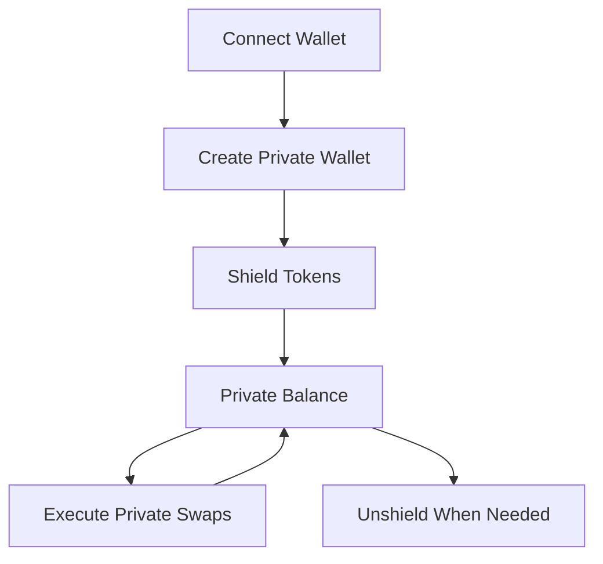

import { DocImage } from '@/components/DocImage';

<DocImage title="What is VoidDEX" />

VoidDex is a privacy-first DEX aggregator that combines the best swap rates across decentralized exchanges with Railgun's zero-knowledge privacy technology. Instead of exposing your trading activity on-chain, VoidDex shields your tokens, executes swaps privately, and protects your financial privacy.

## Overview

VoidDex aggregates liquidity from multiple DEXes including Uniswap V3/V2, SushiSwap, PancakeSwap, QuickSwap, and Camelot while wrapping all operations in Railgun's zkSNARK privacy layer. Your swap transactions become unlinkable to your public address, protecting you from front-running, MEV extraction, and on-chain surveillance.

The platform uses the Railgun SDK to provide native privacy features without requiring custom smart contracts. All privacy operations leverage Railgun's battle-tested infrastructure that has processed significant volume securely.

## How It Works

You start by connecting your regular Web3 wallet and creating a Railgun private wallet. Then you shield tokens from your public balance into your private balance. Once shielded, you can execute swaps privately. Your tokens remain in your private balance until you choose to unshield them to any public address.

## Key Benefits

| Benefit | Description |
|---------|-------------|
| Privacy | zkSNARK proofs hide sender, recipient, and amounts |
| Best Rates | Aggregates across multiple DEXes with smart routing |
| MEV Protection | Private transactions cannot be front-run |
| Non-Custodial | Your keys never leave your browser |

## Current Status

VoidDex is currently in testnet on Sepolia with full private swap functionality. Mainnet support for Ethereum, Polygon, Arbitrum, and BSC is ready and will be enabled when the platform completes final testing. All networks support full Railgun privacy features.

## Getting Started

Connect your Web3 wallet to start trading privately. See the [Quick Start](/docs/quick-start) guide for detailed setup instructions.
